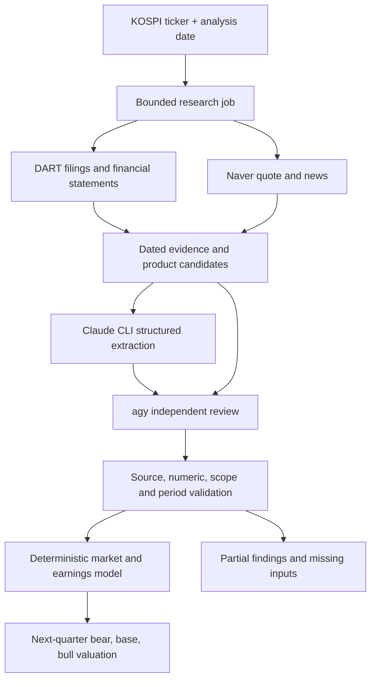

# KOSPI product market analysis server

## User-confirmed additions
Public collection is the default: DART quarterly/half-year/annual filings, Naver finance quotes and public news. Runtime extraction uses local Claude CLI plus the Antigravity CLI (agy) with Google login (subject to account quotas; an expired one is skipped). The CLI models structure and cross-check evidence; deterministic TypeScript code calculates money. Missing sources or failed dual review produces a partial report rather than invented prices. Public analysis is asynchronous with bounded jobs and polling. The detailed integration acceptance contract is INTEGRATION_CONTRACT.md; it supersedes the initial manual-default API choice below. Manual and synthetic demo paths remain explicit alternatives for validation and reproducibility.

## Ownership
Codex owns architecture, financial-model review and acceptance. Claude implements details per this contract. Node.js >=22, TypeScript, Fastify, Zod, Vitest. Local-first server, no trading or deployment.

## Pipeline
Select six-digit KOSPI ticker -> sourced company/product profile -> global product market observations -> next calendar quarter market scenarios -> attributable company revenue/earnings -> equity value per share and upside versus dated quote.

## Data boundaries
Production never silently falls back to synthetic data. Provide explicit demo mode with clearly fictional fixtures for Samsung and Hyundai, not claims about real current prices/shares. Manual validated dataset ingestion is essential because global product market research is not universally free or machine-readable. Each observation/assumption needs source title, URL or manual reference, publication/as-of date. Reject future evidence relative to analysis date, stale/incompatible observations, annual/quarterly confusion, duplicate/overlapping products, invalid shares and missing coverage. Document limits. A registered profile must verify exchange KOSPI. Unknown tickers return actionable missing-data responses. Dataset provider reads local JSON, supports arbitrary registered KOSPI companies. No user-supplied URL fetching.

## Model contract
All market values use explicit quarterly revenue basis and currency; normalize company revenues to KRW via explicit FX. Market share is revenue share within same global product scope/quarter/currency; volume shares cannot be used as revenue shares. Annual CAGR converts via (1+g)^(1/4)-1, then use bounded explicit cyclical/seasonality assumptions. Advance from market observation quarter to target quarter, compounding for elapsed quarters, not just one step. Target is quarter immediately following asOf's calendar quarter. Historical observations plus narrative drivers describe current conditions; separate observed facts from assumptions.

For each bear/base/bull scenario compute market, revenue share (bounded), attributable product revenue, operating profit. Use explicit residual segment revenue/margin when products don't cover whole company; coverage prevents misleading whole-company valuation. Deduct net interest and taxes, then noncontrolling profit to reach common-share attributable earnings. Require net positive earnings for PE valuation or return unavailable. Annualized next-quarter EPS times scenario PE is a valuation proxy, not expected realized market price; label annualization and cyclicality. Shares outstanding are diluted common shares; do not mix preferred claims. Return projected next-quarter earnings, annualized EPS, scenario target price, upside %, assumptions, provenance, limitations, model version, data quality. No unsupported confidence probabilities.

## API and modules
GET /health; GET /v1/companies?query=; GET /v1/companies/:ticker; POST /v1/analyses with ticker, asOf, mode demo|manual (default manual). POST /v1/datasets for validated full company dataset with size limits and atomic local writes; optionally API key for mutations, localhost default. Return consistent structured 400/404/422/502 errors; sanitize secrets. GET /v1/schema or documented JSON schema for ingest. Modules domain/schema, pure model, providers/local + optional DART, service, HTTP. Add official DART company/financial read adapter only if correct documented endpoints with timeout and status errors; do not imply DART supplies global market share. API keys from env, never logs. Default no external API required; upstream fixture tests when adapter included.

## Acceptance
npm install, npm run build, npm test, runnable npm run dev/start. Korean README with commands, curl examples, exact formulas/units, demo vs real data, dataset onboarding for arbitrary tickers, data-source/key limitations. Full sample JSON payload usable for ingestion. Tests should verify compounding across year boundaries, annual conversion, share bounds, coverage, FX, target dates, positive/negative earnings, no synthetic production fallback, bad requests, future/stale sources, atomic persistence/reload and HTTP happy path. Include .env.example, .gitignore and lockfile. Do not deploy, commit, or access unrelated files.
