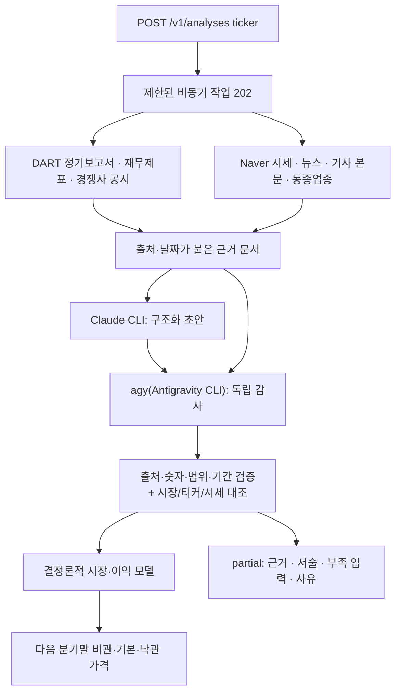

# KOSPI·KOSDAQ 제품 시장 분석 서버

KOSPI·KOSDAQ 보통주 하나를 골라 **공시·시세·뉴스 자동 수집 → 선택한 모델(기본 Claude, 또는 Codex·agy, 두 모델 교차검증 가능) 검토 → 결정론적 재무 모델 → 다음 분기말 비관·기본·낙관 시나리오 가격**을 계산하는 로컬 우선(local-first) 서버입니다. 매매·주문·배포 기능은 없습니다.

- Node.js ≥ 22, TypeScript, Fastify, Zod, Vitest
- **기본 워크플로는 공개 자료 자동 수집(`mode: "public"`)** 입니다: DART 정기보고서/재무제표 + Naver 시세·뉴스. 가상 데모(`demo`)는 명시적으로 요청할 때만 동작합니다. 수동 데이터셋 입력 경로는 없습니다.
- **LLM은 구조화·교차검증만** 합니다. 돈 계산은 순수 TypeScript 모델이 하며, LLM이 만든 값은 문서 인용(원문 구절 + 숫자 대조)과 두 번째 모델의 독립 감사를 통과해야 교차검증된 데이터셋으로 인정됩니다. 한쪽 모델의 로그인/쿼터가 만료되면 그 모델은 호출하지 않고 나머지 모델의 결과만 쓰되(결정론적 검사는 그대로 적용) **교차검증 없음**으로 표시합니다.
- **가능하면 가격을 계산합니다.** 모델 데이터셋이 교차검증을 통과하지 못해도 *하드 검사*(스키마, 올바른 회사, 합성 아님, asOf 이후 데이터 없음, 이중 계산·연간/분기·통화 혼동 없음)를 통과하면 **잠정 가격**(`valuation.grade: "provisional"`)을 내고, 걸린 모든 검사를 `partialReasons`에 `severity: "warning"`으로 남깁니다. 하드 검사에 걸리거나 데이터셋이 아예 없으면 **가격 없이 partial 결과**(수집 근거, 제품/산업 서술, 부족한 입력, 사유)를 돌려줍니다. 합성 데이터로 조용히 대체하지 않습니다.
- 결과는 투자 권고가 아니며 `targetPriceKRW`는 **밸류에이션 프록시**(연환산 EPS × PE)이지 실현 주가 예측이 아닙니다. 확률/신뢰도는 제공하지 않습니다.



## 빠른 시작

사전 준비: Node.js ≥ 22, **Claude Code CLI(`claude`)가 PATH에 있고 로그인되어 있을 것**(기본 분석 모델). 선택 사항: OpenAI Codex CLI(`codex`, ChatGPT 계정 로그인), Antigravity CLI(`agy`)와 Google 계정. 분석 모델은 요청마다 고릅니다(아래 "분석 모델 선택").

### 분석 모델 선택

- 웹 화면의 **분석 모델** 또는 API `POST /v1/analyses`의 `models`(1~2개, 순서대로 작성 → 교차검증)로 고릅니다. **기본값은 Claude 단독**(`["claude"]`)이며 서버 기본값은 `.env`의 `INTELLIGENCE_MODELS`로 바꿀 수 있습니다(예: `claude,agy`).
  - 모델 하나: 그 모델이 초안을 쓰고 별도 호출로 자체 감사합니다 → `single_model`, `crossChecked: false`.
  - 모델 둘(예: `["claude","codex"]`): 앞 모델이 초안, 뒤 모델이 독립 감사 → 둘 다 승인하면 `accepted`. 한쪽이 만료되면 나머지 하나로 진행합니다.
- **Codex 사용법**: `npm i -g @openai/codex` 후 `codex login`(ChatGPT 계정)을 한 번 하면 됩니다. `OPENAI_API_KEY`는 CLI에 전달하지 않습니다(유료 API 경로 없음). Codex는 `codex exec --json --ephemeral --sandbox read-only --ignore-user-config`로 빈 임시 폴더에서 실행되며, 응답 중 셸 명령 등 도구를 쓰면 그 응답은 버립니다(`TOOL_USE_DETECTED`). 모델·추론 강도는 `INTELLIGENCE_CODEX_MODEL`, `INTELLIGENCE_CODEX_EFFORT`로 지정합니다.

```bash
npm install
npm run build

# 1) Antigravity CLI(agy) 설치. ~/.local/bin/agy 에 설치됩니다.
curl -fsSL https://antigravity.google/cli/install.sh | bash
# 2) agy 1회 Google 로그인 (대화형: 브라우저 로그인 후 agy에서 /quit)
npm run agy:login
# 3) DART 키 한 개만 설정 (무료 발급: https://opendart.fss.or.kr)
cp .env.example .env        # .env 의 DART_API_KEY= 뒤에 키 입력 (.env 는 git 제외)
# 4) 점검: 바이너리·로그인·설정 유무만 확인 (모델을 호출하지 않아 사용량 소모 없음, 키 값은 출력하지 않음)
npm run doctor

npm start                   # 또는 개발용: npm run dev
```

- API 키 방식의 유료 경로는 **사용하지 않습니다.** `ANTHROPIC_API_KEY`, `GOOGLE_API_KEY`, `GOOGLE_CLOUD_PROJECT` 등이 환경에 있어도 CLI 자식 프로세스에 전달되지 않습니다. 쿼터는 각 계정 정책을 따릅니다.
- **만료된 모델은 자동으로 건너뜁니다.** agy/Claude의 쿼터 소진(`QUOTA`)·미로그인(`AUTH_REQUIRED`)·CLI 없음(`CLI_NOT_FOUND`)이 확인되면 그 모델을 쿨다운 동안(쿼터는 CLI가 알려준 리셋 시각, 없으면 30분 / 로그인 문제는 5분) 호출하지 않아 매번 45~60초씩 기다리지 않습니다. Claude가 만료되면 agy가 초안을, agy가 만료되면 Claude 초안만 사용하며 결과는 `research.status: "single_model"`, `crossChecked: false`, `notes`에 만료 사유와 재사용 가능 시각이 표시됩니다. 둘 다 만료되면 partial입니다. 타임아웃·잘못된 응답 같은 일시 오류는 만료로 취급하지 않습니다(이 경우 검토 실패로 partial).
- **DART 키가 없어도** Naver 시세·뉴스는 수집되지만 재무제표·사업 내용이 없어 가치 산정은 불가(partial)입니다. Naver 뉴스검색 키(`NAVER_CLIENT_ID/SECRET`)는 선택입니다.
- 모델 없이 근거만 확인하려면 agy 로그인 전에도 `POST /v1/research`(evidence-only)를 쓸 수 있습니다.
- 실제 네트워크 스모크(LLM 미사용): `npm run smoke:public -- 005930` (DART 키가 없으면 Naver만).
- **분석 대상은 KOSPI·KOSDAQ 일반주(보통주)만**입니다. 티커는 6자리 KRX 코드(숫자 또는 신규 영숫자 코드). 우선주(티커 끝자리 ≠ 0 또는 `…우`/`…2우B` 이름), ETF/ETN(Naver `stockEndType`), 리츠·인프라투융자회사·스팩·선박투자회사(법인명·DART 업종코드 6420x)는 거부합니다.
  - `POST /v1/analyses`, `POST /v1/research`: 우선주 티커는 네트워크 호출 없이 즉시 **422 `NOT_COMMON_STOCK`**, ETF/리츠 등은 수집 직후 job이 `failed`(`error.code: NOT_COMMON_STOCK`)이며 모델은 호출되지 않습니다.
  - 시장은 Naver(`KS`/`KQ`)와 DART(`corp_cls` `Y`/`K`)로 확인합니다. 그 밖의 시장(KONEX 등)은 `failed`(`NOT_LISTED`), 두 출처가 시장을 다르게 말하면 미확인(`EXCHANGE_UNVERIFIED` 경고)입니다.
  - 이름·티커 규칙에 기반한 **최선 노력(best-effort) 선별**이며 거래소가 부여한 공식 분류가 아닙니다. 새로운 명명 규칙의 상품은 `src/domain/security.ts`에서 보완하세요.
- **기준일(asOf)은 항상 오늘(Asia/Seoul)**입니다. 공개 분석(`/v1/analyses` public, `/v1/research`)은 요청의 `asOf`를 무시합니다(데모 모드만 `asOf`를 씁니다).
- **경쟁사는 자동으로 고릅니다.** `competitors`를 주지 않으면 네이버 증권의 동종업종 비교 목록에서 KOSPI·KOSDAQ 보통주 최대 6곳을 골라 DART 공시 매출을 수집하고, `evidence.competitorSelection: "naver_industry"`로 표시합니다. 같은 업종이라도 실제 제품 시장 경쟁사가 아닐 수 있으므로 모델이 걸러내고, 해외 경쟁사는 추정 규칙으로 추가합니다. 미국·일본 기업을 공시 수치로 비교하려면 API에서 `competitors`를 직접 지정하세요(지정하면 자동 선정 대신 그 목록을 씁니다).
- `npm run doctor`는 증거 수집(DART 키)과 전체 분석(Claude·Codex·agy 중 로그인된 모델, 둘 이상이면 교차검증 가능)의 준비 상태를 따로 보고합니다(Codex는 `codex login status`로 확인).

## 라우트

| 메서드 | 경로 | 설명 |
|---|---|---|
| GET | `/health` | 상태, 모델 버전, 작업 큐 통계, 연동 설정 여부(boolean만) |
| POST | `/v1/analyses` | `{ticker, asOf?, mode?, models?}` (`models`: `claude`/`codex`/`agy` 중 1~2개, 기본 `["claude"]`). **`mode` 기본 `public` → 비동기 작업 202**. `demo`는 동기 200 |
| GET | `/v1/analyses/:id` | 작업 상태/결과 폴링 (`queued`/`running`/`completed`/`partial`/`failed`) |
| POST | `/v1/research` | **근거 수집 전용 작업**(Claude/agy 호출 없음, 가치 산정 없음). 202 |
| GET | `/v1/research/:id` | 근거 수집 작업 폴링 |
| GET | `/v1/universe?query=&limit=` | KOSPI·KOSDAQ 보통주 목록(네이버 증권, 서버 캐시). `limit` 최대 5000 — 웹 화면은 전체 목록을 한 번 받아 종목명·초성·번호로 검색하고 드롭다운에서 고릅니다 |
| GET | `/v1/companies?query=` | 데모(가상) 종목 검색 |
| GET | `/v1/companies/:ticker` | 데모(가상) 종목 프로파일 |
| GET | `/v1/schema` | 데이터셋 JSON Schema (`result.research.draftDataset.dataset`의 형식) |

- 공개 분석의 기준일은 항상 **Asia/Seoul 오늘 날짜**이며 `asOf`는 무시됩니다. 데모 모드에서는 `asOf` 생략 시 오늘, 미래 날짜는 400 `INVALID_AS_OF`.
- `API_KEY`를 설정하면 **모든 public 분석/근거 수집 작업 생성 및 그 결과 조회**와 전략 기록 API에 `x-api-key` 헤더가 필요합니다(`demo` 동기 분석과 `health`는 제외). `HOST`가 루프백이 아니면 `API_KEY` 없이는 서버가 기동하지 않습니다.
- 작업은 **메모리에만 저장**되어 서버 재시작 시 사라집니다. 완료 후 `RESEARCH_JOB_TTL_MS`(기본 1시간)가 지나면 404 `JOB_NOT_FOUND`.
- 동일한 진행 중 요청(같은 종류·티커·asOf)은 **중복 제거**되어 같은 `id`를 돌려줍니다(`deduplicated: true`). 실행 중/대기 중 상한을 넘으면 429 `QUEUE_FULL`. 종료(`SIGINT/SIGTERM`) 시 실행 중 작업의 CLI 자식 프로세스를 중단하고 대기 작업은 실패 처리합니다.

오류 형식: `{ "error": { "code", "message", "details?", "hint?" } }` — 400(검증) / 401(키) / 404 / 413 / 422(데이터 부적합) / 429(큐 가득) / 502(로컬 저장소) / 503(종료 중) / 500. 응답과 로그에는 키·스택이 포함되지 않습니다.

### curl 예시

```bash
# 공개 자료 자동 분석 (기본 mode=public; API_KEY 설정 시 -H "x-api-key: $API_KEY" 추가)
curl -s -i -X POST localhost:3000/v1/analyses -H 'content-type: application/json' \
  -d '{"ticker":"005930"}'
# -> 202 {"id":"…","status":"queued","statusUrl":"/v1/analyses/…","deduplicated":false}

# 폴링 (완료까지 수 분 걸릴 수 있음)
curl -s localhost:3000/v1/analyses/<id>

# 경쟁사를 직접 지정 (생략하면 네이버 동종업종에서 자동 선정; 미국은 SEC_USER_AGENT, 일본은 EDINET_API_KEY 필요)
curl -s -X POST localhost:3000/v1/analyses -H 'content-type: application/json' \
  -d '{"ticker":"005380","competitors":["KR:000270","US:F","JP:7203"]}'

# 근거만 수집 (LLM 미사용, agy 로그인 전에도 가능)
curl -s -X POST localhost:3000/v1/research -H 'content-type: application/json' \
  -d '{"ticker":"005930"}'
curl -s localhost:3000/v1/research/<id>

# 결정론적 데모 (가상 데이터, 동기; asOf 는 2026-09-28 부근에서만 신선도 검증 통과)
curl -s -X POST localhost:3000/v1/analyses -H 'content-type: application/json' \
  -d '{"ticker":"005930","asOf":"2026-09-28","mode":"demo"}'

# 완료된 작업에서 모델이 만든 초안 데이터셋만 꺼내기 (jq 필요)
curl -s localhost:3000/v1/analyses/<id> | jq '.result.research.draftDataset'
curl -s localhost:3000/v1/schema
```

### 작업 결과 구조 (`GET /v1/analyses/:id`)

```jsonc
{
  "id": "…", "kind": "analysis", "status": "completed | partial | failed | queued | running",
  "request": { "ticker": "005930", "asOf": "2026-09-28", "mode": "public" },
  "createdAt": "…", "startedAt": "…", "finishedAt": "…", "expiresAt": "…",
  "result": {
    "evidence":  { /* 제공자 상태·이슈, 회사(KOSPI/KOSDAQ 검증), 시세, 뉴스, 공시 목록, 상품/지표 후보, requiredInputs, 모델에 전달한 문서 목록 */ },
    "research":  { /* Claude/agy 각각의 상태·코드, `crossChecked`, 만료된 모델 목록(`unavailable`), 제품/산업 서술(한국어), 인용, 가정, 불일치, 부족 필드, 감사 결과, 초안 데이터셋(`draftDataset`, 아래) */ },
    "analysis":  { /* 결정론적 모델 출력(아래 '모델' 참고). partial 이면 null */ },
    "valuation": { "status": "available | partial | unavailable", "scenarios": { "bear": "available", … }, "grade": "verified | provisional | null" },
    "partialReasons": [ { "code", "severity": "blocking | warning", "message", "details?" } ],
    "missingInputs":  [ { "source": "collector | intelligence | gate", "field", "detail?" } ],
    "notes": []
  },
  "error": { "code", "message" }        // failed 일 때
}
```

- `completed`: 사유 없이 데이터셋이 이중 검토·결정론 검증을 모두 통과하고 세 시나리오 가치가 모두 산출됨. 이때 `missingInputs`는 비어 있습니다(수집기의 사전 부족 목록은 `evidence.requiredInputs`에 남음).
- `partial`: 가격 없음(`blocking` 사유가 있어 `analysis: null`), 잠정 가격(`warning` 사유만 있어 `analysis` 유지, `valuation.grade: "provisional"`), 또는 일부 시나리오 가치 불가(`VALUATION_UNAVAILABLE`, `analysis`는 유지). **수집 근거, 제품/산업 서술, 부족한 입력과 사유는 항상 노출**됩니다.
- `failed`: 수집 실패, KOSPI·KOSDAQ 상장 종목이 아님(`NOT_LISTED`), 보통주가 아님(`NOT_COMMON_STOCK`), 타임아웃(`JOB_TIMEOUT`), 종료(`SERVER_CLOSING`) 등.

주요 `partialReasons` 코드:
- `blocking`(가격 없음): `NO_EVIDENCE_DOCUMENTS`, `INTELLIGENCE_ERROR`, `RESEARCH_NOT_ACCEPTED`(쓸 수 있는 데이터셋 없음), `DATASET_SCHEMA_INVALID`, `DATASET_TICKER_MISMATCH`, `DATASET_SYNTHETIC`, `DATA_VALIDATION_FAILED`(하드 이슈: asOf 이후 데이터, FX/시장/커버리지 누락, 점유율 > 1, 매출 초과·이중 계산, 연간 기준 등), `MODEL_FAILED`.
- `warning`(잠정 가격): `EXCHANGE_UNVERIFIED`, `QUOTE_MISSING`·`HISTORICAL_QUOTE_UNAVAILABLE`(데이터셋 문서상 시세를 미검증으로 사용), `PROVIDER_ERROR`(Claude/agy 상태는 `research.providers`), `RESEARCH_PROVISIONAL`(감사 미승인·미확인 숫자·인용 누락 등, 상세는 `research.audit.issues`), `DATASET_QUOTE_REPLACED`(수집한 Naver 시세로 교체), `DATASET_REPAIRED`(분기 정렬·중복 제거, 미종료 분기 제거, 점유율 범위 확장, 잔여 매출 가정 추가), `DATA_VALIDATION_WARNINGS`(오래된 근거, 커버리지 부족, 분기 급변 등), `VALUATION_UNAVAILABLE`.

**초안 데이터셋 (`result.research.draftDataset`)**: 모델이 작성한 데이터셋을 결과에 그대로 싣습니다(저장하지 않음). 초안이 없으면(모델 미호출·전부 만료 등) `null`입니다.

```jsonc
"draftDataset": {
  "status": "reviewed | provisional | rejected",
  "serverRepaired": false,   // 서버가 분기 정렬·중복 제거 등 보정을 적용했는지(DATASET_REPAIRED)
  "dataset": { /* GET /v1/schema 형식의 전체 데이터셋 */ }
}
```

- `reviewed`: 모델 검토(교차검증 또는 단일 모델)를 통과한 데이터셋. `provisional`: 소프트 문제(미확인·미인용 숫자, 감사 미승인 등)만 있어 잠정 가격에 쓰인 데이터셋. 이 두 경우 `dataset`은 서버 보정 후 **가치 산정에 실제로 들어간 값**입니다(단, 서버 게이트의 차단 사유가 있으면 `analysis`는 `null`).
- `rejected`: 하드 검사(스키마, 티커, asOf 이후 자료 등)에 실패한 **원본 초안 그대로**입니다. 스키마를 위반할 수 있으며 가치 산정에 쓰이지 않았습니다. 이유는 `research.audit.issues`와 `partialReasons`에 있습니다.
- 초안의 추정 항목은 각 값의 `estimate`와 `research.estimates`로 구분됩니다.

## 이중 모델 검토 흐름

1. 수집기(`src/collection`)가 DART(정기보고서 최대 8건, 재무제표, 사업의 내용·표 발췌, 주식의 총수 현황)와 Naver(시세, 일별 종가, 분기·연간 실적/컨센서스, 종목 뉴스, 상위 기사 본문, 선택적 뉴스검색 — 키가 있으면 제품별 "세계 시장 규모"·"점유율 매출 분기" 검색으로 시장조사기관 인용 기사를 찾아 본문과 시장 규모·점유율 수치 후보를 추출), ECB 기준환율(키 불필요)을 가져옵니다. 일별 종가와 분기 EPS로 후행 PER 참고 범위도 계산합니다. 화이트리스트 호스트만 호출하며 사용자 URL은 가져오지 않습니다.
2. `src/research/evidence.ts`가 근거를 `{id,title,url,publishedAt,text}` 문서로 변환합니다. URL/날짜는 **실제 접수번호 URL·접수일, Naver URL·거래/기사 시각(KST 환산)** 에서 오며 모델이 만들지 않습니다. 재무제표는 행별 통화·소수점을 보존하고, 손익만 분기/연간으로, 재무상태표는 기말 잔액, 현금흐름은 공시 제공 기준으로 표기합니다. 파생 4분기(연간−3분기 누적)는 연간 보고서 접수일/URL을 쓰고 두 접수번호를 본문에 남기며, 3분기 정정이 더 늦으면 파생을 보류합니다. 뉴스는 제품·시장·점유율을 다루는 기사를 우선하고 기사 본문(있으면)/스니펫으로 표기합니다.
3. Claude가 초안(Dataset·서술·인용·가정)을, agy(Gemini 계열 모델)가 같은 원문으로 독립 감사를 수행합니다. **둘 다 성공하고 승인·확인하면** 교차검증된 데이터셋(`accepted`)입니다. 한쪽이 **만료**(쿼터/로그인/CLI 없음)면 그 모델은 호출하지 않고 나머지 모델의 초안만으로 진행하되(`single_model`) 인용·숫자·날짜 검사는 똑같이 통과해야 합니다. **agy 감사가 만료 외의 이유(타임아웃, 잘못되거나 잘린 응답, 스키마 오류, CLI 오류 등)로 실패해도 Claude가 대신 감사**합니다(`single_model`; 그 agy 실패는 이번 실행에만 `unavailable`에 남고 쿨다운은 없음). 감사 결과의 불일치·미승인과 Claude 쪽 실패는 그대로 partial입니다.
4. 서버가 다시 검사: 스키마, 티커 일치, 실제 KOSPI/KOSDAQ 검증, 시세(가격·거래일) 일치, 정적·asOf 검증(아래 표). 통과하면 순수 `analyze()`로 계산합니다.

한계: 인용 검증은 "원문에 그 구절이 있고 숫자가 도출된다"까지만 증명하며 의미의 진실성은 증명하지 못합니다. 공시 본문에 글로벌 제품 시장의 분기 매출 시계열이 없더라도(대부분 그렇습니다) 데이터셋 작성이 멈추지 않고, 아래 "추정치와 경쟁사 합계" 규칙에 따라 **추론한 값으로 예측**하되 그 사실을 모든 출력에 표시합니다.

### 한 모델만 동작해도 모든 검사를 마칩니다

Claude와 agy 중 하나가 만료(쿼터/로그인/CLI 없음)되거나 agy 감사가 어떤 이유로든 실패해도 검사 단계는 줄지 않습니다. 남은 모델이 초안을 쓰고, **별도 호출(새 세션, 반증을 찾도록 지시한 감사 프롬프트)로 자기 초안을 다시 감사**하며, 결정론적 검사(인용·숫자·단위·날짜·추정 규칙)는 그대로 적용됩니다. 이 경우 결과는 `single_model`이고 `crossChecked: false`, `audit.independentAudit: false`이며 보고서에 "독립 교차검증 아님"으로 표시됩니다. 자체 감사 호출마저 만료되면 결정론적 검사만으로 `single_model`이 되고 그 사실도 표시됩니다.

### 타임아웃 문제 해결

- `providers.claude.code`(또는 `agy`)가 `TIMEOUT`이면 **그 모델 호출 자체**가 설정된 시간(`INTELLIGENCE_TIMEOUT_MS`, 기본 600000ms=10분) 안에 끝나지 않은 것입니다. Claude 초안이 TIMEOUT이면 서버가 자동으로 agy로 폴백해 초안을 다시 시도합니다(같은 실행에서 타임아웃난 모델은 그 이후 감사자로도 다시 호출하지 않습니다).
- 작업 결과 `error.code`가 `JOB_TIMEOUT`이면 **전체 작업**(수집+모델 호출 전체)이 `RESEARCH_JOB_TIMEOUT_MS`(기본은 설정하지 않으며, `INTELLIGENCE_TIMEOUT_MS × 최대 7회 호출 + 300000ms 여유`로 자동 계산됨— 기본값끼리는 4500000ms=75분)를 넘긴 것입니다. 이 둘은 서로 다른 메커니즘이며 서버 로그에서 `[intel]`/`[config]` `DIAGNOSTIC` 줄로 둘의 관계(설정된 예산이 실제 필요한 값보다 작은지)를 알려줍니다.
- **`INTELLIGENCE_TIMEOUT_MS`는 절대 자동으로 줄어들지 않습니다.** 예전 버전은 `RESEARCH_JOB_TIMEOUT_MS`의 옛 고정 기본값(900000ms)과 맞지 않으면 개별 호출 타임아웃을 몰래 줄였는데(예: 600000ms를 280000ms로), 지금은 그러지 않고 서버 시작/실행 로그에 경고만 남깁니다. `RESEARCH_JOB_TIMEOUT_MS`를 직접 설정했다면 항상 그 값 그대로 적용됩니다.
- `INTELLIGENCE_TIMEOUT_MS`를 바꾸면(`.env`) **서버를 재시작**해야 적용됩니다(`RESEARCH_JOB_TIMEOUT_MS`를 명시하지 않았다면 재시작 시 새 기본 작업 예산도 함께 다시 계산됩니다).
- `BAD_JSON`은 모델 호출은 성공했지만 응답에서 JSON 객체를 꺼내지 못한 경우입니다. 로그의 `reason=`에 응답의 형태만 남습니다(내용은 남기지 않음). `startsWithBrace=true endsWithBrace=false`와 `Unterminated string`/`Unexpected end`가 함께 보이면 응답이 중간에 잘린 것이고, `startsWithBrace=false`면 모델이 JSON 대신 문장으로 답한 것입니다. 응답에 JSON 객체가 여러 개 들어 있으면(예: ```json 블록 두 개, 답을 고쳐서 다시 쓴 경우) 각 객체를 따로 꺼내 스키마에 맞는 마지막 객체를 사용하므로, `Unexpected non-whitespace character after JSON`은 그중 어느 것도 파싱되지 않을 때만 남습니다. Claude Code가 출력 토큰 한도에 걸린 것이 확인되면 `OUTPUT_LIMIT`으로 보고됩니다. 이때는 `.env`에 `CLAUDE_CODE_MAX_OUTPUT_TOKENS`(예: `64000`)를 설정하고 서버를 재시작하세요.
- 모델에 보내는 근거 문서 크기는 `INTELLIGENCE_EVIDENCE_CHAR_BUDGET`(기본 90000자)로 제한되지만, 문서 종류(시세, 재무제표, 사업의 내용, 표, 참고 지표, 뉴스)별로 최소 배분을 보장하므로 재무제표가 많다고 사업 서술·주식수 근거가 사라지지 않습니다. 원본 수집 데이터(`GET /v1/research/:id`의 `evidence` 필드)는 잘리지 않습니다.

### 추정치와 경쟁사 합계

정확한 전체 시장 규모를 구할 수 없으면 이전 자료로 **추론해서라도 예측**합니다. 허용 범위와 규칙:

- **추정 가능한 값**: 시장 규모(`markets[].observations[]`), 제품 매출(`products[].revenue[]`), 경쟁사 매출(`competitors[].revenue[]`). **주가·주식수·환율·회사 총매출은 절대 추정하지 않습니다**(인용 필수).
- 추정 항목은 `estimate: {method, basedOn, rationale}`와 `source.manualReference: "MODEL_ESTIMATE: …"`(또는 그 값을 도출한 실제 문서)를 가져야 합니다. `method`: `share_implied`(제품 매출 ÷ 문서에 적힌 점유율), `prior_extrapolation`(이전 시점 값 × 성장률), `sum_of_players`(회사 + 경쟁사 + 추정 기타), `segment_allocation`, `period_allocation`(공시된 반기·연간 매출을 분기로 배분; 일본 기업은 반기 공시만 있음), `article_synthesis`(여러 기사의 서로 다른 누적 판매량·매출 수치를 단위·기간을 맞춰 종합한 대략값; 중앙값 기본, 범위 밖 값 금지, `basedOn`에 기사 문서 id 2개 이상 필수), `model_knowledge`(문서 없이 모델의 배경지식 — 가장 낮은 등급). `basedOn`은 근거가 되는 dataset 경로/문서 id이며 `model_knowledge` 외에는 비어 있으면 안 되고, 자기 자신을 근거로 삼거나 존재하지 않는 경로/문서를 가리키면 거부됩니다(`ESTIMATE_*` 코드).
- 추정치는 인용이 필요 없는 대신 **감사 모델이 항목별로 타당성(`reasonable/unreasonable/unverifiable`)을 평가**합니다. `unreasonable`이면 데이터셋이 거부됩니다. 출처에서 읽은 값에 `estimate`를 붙이지 않은 채 인용을 생략하면 `NUMBER_UNCITED`로 거부됩니다(추정을 관측값으로 위장할 수 없음).
- **경쟁사(`competitors[]`)**: 같은 시장의 주요 업체 매출(문서에서 인용하거나 추정). 검증: 시장 통화·분기 일치, 연속 분기, 그리고 **회사 + 명시된 경쟁사 합이 "보고된" 시장 규모를 넘으면 `PLAYERS_EXCEED_MARKET`으로 거부**합니다. 시장 규모가 **추정치**이고 명시된 업체 합보다 작으면 거부하지 않고 **합계로 끌어올린 뒤** 그 조정을 `dataQuality.adjustments`와 경고로 보고합니다.
- **합계 정합성(모델)**: 최근 확정 분기의 `회사 + 경쟁사 + 기타(=시장 − 파악된 업체) = 시장 규모`이며 `identifiedCoverage`(파악된 업체 비중)를 보고합니다. 전망 분기에서는 `share_c(T) = clamp(share_c(최근) + shareDelta_c)`로 경쟁사를 전개하고, 회사와 경쟁사 몫의 합이 100%를 넘으면 경쟁사를 남은 몫에 맞게 비례 축소(`competitorsScaled`, 축소 전 합계 `bottomUpBeforeScalingPct` 보고)한 뒤 `기타 = 1 − Σ`로 닫아서 **모든 구성요소의 합이 항상 전망 시장 규모와 같습니다**(`partsSumGapPct ≈ 0`).
- **보고서(`result.report`)**: 한국어 요약(`lines`)과 함께 시장 규모(최근 확정 vs 전망, 추정 여부·방법), 업체별 점유 표(회사/경쟁사/기타, 최근 vs 전망), 합계 검증, 시나리오별 목표가, 품질 요약(추정 입력 수, `dataGrounding` 높음/보통/낮음, 교차검증 여부, 만료 모델)을 담습니다. `dataGrounding`은 확률이 아니라 "매출 입력 중 출처에서 읽은 비율"의 정성 등급입니다. 추정한 시장 규모가 전분기 대비 ±30%를 넘게 움직이면 별도 경고를 붙입니다.
- 추정 의존도가 높을수록 비관~낙관 범위는 매우 넓어질 수 있습니다. 추정치 기반 결과는 참고용 시나리오이지 투자 권고나 실현 가격 예측이 아닙니다.

## 모델: 정확한 수식과 단위

모든 금액은 **분기 매출 기준**입니다. 시장·제품 값은 해당 통화 단위 그대로(예: USD 1e9 = 10억 달러), 회사 값은 KRW.

**목표 분기** `T` = 회사 실적이 아직 발표되지 않은 첫 분기(`financials.quarter`의 다음 분기)입니다. 단, `asOf` 기준으로 막 끝난 분기와 진행 중인 분기 사이로 제한하고, 모든 시장의 최신 관측 분기보다 뒤여야 합니다(목표 분기는 항상 관측치가 아닌 예측). 예: 서울 기준 2026-10-01, 실적이 2026Q2까지 발표 → 2026Q3(끝났지만 미발표이므로 건너뛰지 않음). 2026Q3 실적이 발표된 뒤에는 진행 중인 2026Q4가 목표입니다(`targetQuarterIndex`, `src/domain/validate.ts`). 분기 인덱스는 `연도×4 + (분기−1)`이라 연도 경계에서도 정확히 누적됩니다. 시나리오 가격은 이 **다음 분기 실적 기준 프록시**입니다.

**시나리오**: 가정값은 비관(`bear`) · 기본(`base`) · 낙관(`bull`) 세 가지이며, 화면과 보고서에는 한국어로, API·데이터셋 필드에는 괄호 안의 영문 키로 표시됩니다. 각 시나리오의 확률을 뜻하지 않습니다.

**1. 연 CAGR → 분기율**: `gq = (1+g)^(1/4) − 1`

**2. 시장 전개** (최신 관측 분기 `L`, `n = T − L ≥ 1`, 계절성 지수 `s[q]`, 주기 배수 `c`):
```
Market(T) = Market(L) / s[L의 분기] × (1+gq)^n × s[T의 분기] × c
```
관측 분기와 목표 분기 사이 **모든 경과 분기**를 복리로 누적합니다.

**3. 점유율**: 최신 공통 분기 `Q*`에서 `share0 = 제품매출(Q*) / 시장매출(Q*)` (같은 범위·분기·통화의 **매출** 점유율; 거래량 점유율 사용 불가). 겹치는 **모든 과거 분기**에서 제품매출 ≤ 시장매출이어야 합니다. `share_s = clamp(share0 + Δ_s, min, max)`.

**4. 귀속 제품 매출(KRW)**: `Rev_p,s = Market(T)_s × share_s × fx` (`fx` = KRW/통화 단위, KRW는 1)

**5. 잔여(residual) 부문**: 실적 분기 `F`에서 `잔여매출 = 총매출 − Σ(제품매출×fx)`, `Rev_res,s = 잔여매출 × (1+gq_res,s)^(T−F)`. **미포함 매출이 총매출의 0.01%(반올림 허용오차)를 넘으면 명시적 `residual` 가정이 필수**입니다(조용히 버려지는 매출 없음). 커버리지 50% 미만이거나 제품 매출 합이 총매출을 넘으면 거부.

**6. 영업이익**: `OP_s = Σ Rev_p,s × margin_p,s + Rev_res,s × margin_res,s`

**7. 당기순이익 브리지**:
```
세전 = OP + 순이자
세금 = max(0, 세전) × 세율          (적자 시 세금 환급 없음)
순이익 = 세전 − 세금
비지배 = 순이익 × 비지배지분율
보통주 귀속이익 = 순이익 − 비지배 − preferredClaimsKRW
```
`preferredClaimsKRW` = **우선주 계층에 귀속되는 다음 분기 이익 총액(배당 + 참가 몫 모두)**. 모델은 자본 종류별 권리를 스스로 유도하지 않으므로 작성자가 명시하고 `rationale`(필수)에 근거를 적어야 합니다. 누락/과소 입력은 보통주 EPS를 과대 계상합니다. 주식 수는 **희석 보통주만** 사용합니다.

**8. 밸류에이션 프록시** (보통주 귀속이익 > 0일 때만; 아니면 `status: "unavailable"`):
```
분기 EPS = 귀속이익 / 희석 보통주수
연환산 EPS = 분기 EPS × 4          (계절성·주기성 미반영 단순 연환산)
목표가 = 연환산 EPS × PE_s
업사이드 % = (목표가 / 시세 − 1) × 100
```

**관측 vs 예측 구분**: `facts.markets[].observedLatest`는 이미 끝난 분기의 실제 관측치(최신 분기, QoQ, 5분기 이상이면 YoY와 기준 분기)이고, `scenarios[]`는 목표 분기 **예측(nowcast)** 입니다(`marketVsLatestObservedPct`, `marketYoYPct`는 예측값을 관측치와 비교). `facts.productContribution`은 실적 분기 회사 매출 기여도 순위(주요 제품)입니다. 모든 출력 숫자는 유한(finite)함이 검증되며, 입력은 크기 상한으로 오버플로를 막습니다(`MODEL_NON_FINITE` 422).

## 데이터셋 구조

구조: `company`, `quote`, `shares{dilutedCommon}`(희석 **보통주**), `fx[]`, `financials{quarter,totalRevenueKRW}`, `markets[]`(≥4개 연속 분기 관측 + 성장/계절성/주기 가정), `products[]`(시장당 1개, 시장과 같은 통화의 분기 매출, 점유율 변화·범위·마진), `residual`, `earningsBridge`(`netInterestKRW`, `effectiveTaxRate`, `noncontrollingShare`, `preferredClaimsKRW`), `valuation.peMultiple`.

### 서버가 거부하는 것 (422)

| 코드 | 조건 |
|---|---|
| `FUTURE_EVIDENCE` | 출처 발행일/시세/FX/주식수 기준일이 `asOf` 이후, 또는 `asOf`까지 끝나지 않은 분기 |
| `STALE_EVIDENCE` | 시세 > 14일, FX > 30일, 주식수 > 200일, 출처 > 730일, 최신 시장/실적/점유율 분기가 `asOf`가 속한 분기보다 3분기 초과 이전 |
| `SOURCE_BEFORE_PERIOD_END` | 보고 분기 종료 전 발행된 출처(시장·제품·**재무** 관측), 자신의 기준일보다 앞선 시세/주식수/FX 출처 |
| `ANNUAL_QUARTERLY_CONFUSION` | `basis: "annual"`, 인접 분기 대비 3배 초과/1/3 미만 변동 |
| `NON_CONSECUTIVE_OBSERVATIONS` | 분기 누락/중복/역순 |
| `INVALID_SHARE` / `SHARE_OUT_OF_BOUNDS` | **겹치는 어느 분기든** 제품 매출 > 시장 매출, 관측 점유율이 `shareBounds` 밖 |
| `CURRENCY_MISMATCH` / `MISSING_FX` | 제품·시장 통화 불일치, FX 누락 |
| `DUPLICATE_PRODUCT` / `DUPLICATE_MARKET` / `OVERLAPPING_PRODUCT_MARKET` / `UNUSED_MARKET` | 중복(대소문자·문장부호 무시 텍스트 일치), 같은 시장에 제품 2개, 어떤 제품도 쓰지 않는 시장. **의미상 중복 탐지는 하지 않습니다** |
| `MISSING_COVERAGE` | 실적 분기의 제품 매출 없음, 제품/시장 공통 분기 없음 |
| `COVERAGE_INSUFFICIENT` / `COVERAGE_EXCEEDS_TOTAL` / `RESIDUAL_REQUIRED` | 커버리지 < 50%, 제품 매출 합 > 회사 매출, 미포함 매출 > 0.01%인데 `residual` 없음 |
| `SEASONALITY_NOT_NORMALISED` | 계절성 지수 평균이 1±0.02 밖 |
| `PLAYERS_EXCEED_MARKET` / `DUPLICATE_COMPETITOR` / `COMPETITOR_MARKET_UNKNOWN` | 회사 + 명시된 경쟁사 합이 **보고된** 시장 규모 초과, 경쟁사 id 중복, 알 수 없는 시장 (추정 시장 규모는 합계로 끌어올림) |

입력 숫자는 유한하고 크기가 제한됩니다(금액 ≤ 1e18 등). 적재 시에는 시점 무관 규칙과 "서버 시계(Seoul) 기준 미래 근거"만 검사하고, 신선도(STALE)는 **분석 시점** `asOf`로 검사합니다.

## 데이터 출처와 한계

- **DART**: 정기보고서·재무제표·사업 내용을 제공하지만 글로벌 제품 시장 점유율/시장 규모 시계열은 제공하지 않습니다. 시장 매출은 공시 본문에 회사가 밝힌 경우만 후보로 추출됩니다(연/분기, 출하량/매출을 변환하지 않음).
- **경쟁사 공시(DART·SEC EDGAR·EDINET)**: 요청의 `competitors`로 지정한(생략 시 네이버 동종업종에서 자동 선정한 국내) 한국·미국·일본 기업의 공시 매출(회사 전체, 원 통화)을 근거 문서로 넘깁니다. 글로벌 비교는 이 세 나라 기업만 하며, 다른 나라 기업은 시장의 "기타"로 묶습니다. 일본은 2024년 이후 반기·연간 공시만 있어 분기 값은 추정(`period_allocation`)입니다. 통화가 다르면 수집한 ECB 기준환율(원화 환산) 문서로 환산하며, 그 문서에 없는 통화(TWD 등)의 환산값은 추정으로 표시됩니다.
- **Naver**: 시세는 **최신 스냅샷**(과거 종가 조회 아님)이라 과거 `asOf`에는 시세가 없어 partial입니다. 뉴스 스니펫/본문만으로는 검증된 예측이 아니며 뉴스는 예측 근거로 취급되지 않습니다.
- **LLM**: Claude·agy 모두 같은 문서를 읽는 LLM이므로 합의가 곧 진실은 아닙니다. agy는 Google 로그인 개인 한도에 종속되며(2026-09 기준 소진 시 리셋까지 약 17시간), 프롬프트는 argv 한 개로 전달되므로 macOS 인자 한도(약 1MB) 아래로 제한됩니다(900,000바이트 초과 시 `OUTPUT_LIMIT`).
- FX는 데이터셋의 단일 기준일 환율 하나로 모든 분기를 환산합니다. 잔여 부문은 계절성 없이 일정 성장률로 전개합니다. 인접 분기 3배 초과 변동은 연/분기 혼동으로 간주되어 실제로 급변하는 시장은 거부될 수 있습니다.
- 작업 큐는 단일 프로세스 메모리(재시작 시 소실)입니다.
- API 메시지는 영어, 문서는 한국어입니다. 상세: `COLLECTION.md`(수집), `INTELLIGENCE.md`(모델 실행·격리), `DATA_SOURCES.md`.

## 개발

```bash
npm run build        # tsc
npm test             # vitest (실제 네트워크/LLM 호출 없음: 수집기와 모델은 주입된 가짜로 검증)
npm run doctor       # 환경 점검 (--json 지원)
npm run smoke:public -- 005930             # 실제 Naver(+DART 키 있으면 DART) 수집 스모크, LLM 미사용 (--no-dart 로 DART 제외)
npm run smoke:job                          # 실제 수집기로 HTTP POST /v1/research → 폴링 (인프로세스, LLM 미사용)
```

```
src/domain/       스키마(Zod)·검증·시간 유틸
src/model/        순수 결정론적 모델
src/collection/   DART·Naver 공개 자료 수집 (다른 작성자)
src/intelligence/ Claude·Codex·agy CLI 실행·검증·만료 처리
src/research/     근거→문서 변환, 작업 큐, 공개 분석 파이프라인, doctor
src/http/         Fastify 라우트·오류·인증
src/providers/    로컬 JSON 저장소(원자적 쓰기)
scripts/          agy 로그인, 공개 수집 스모크
data/demo/        가상 데모 픽스처   examples/  적재용 전체 샘플
test/ tests/      Vitest
```

## 실적 기대 차이·투자·위험 전략

**자동 분석은 한 분기만 추정합니다(단기, 최장 3개월).** 방금 끝나 실적이 아직 나오지 않은 분기 또는 진행 중인 분기 하나의 매출·영업이익·EPS를, 최근에 공시된 한 분기 실적만 있어도 추정합니다. 컨센서스가 없어도 추정 결과가 나오며(`estimate_only`), 네이버 증권이 컨센서스로 표시한 같은 분기 값은 추정 옆에 참고로만 보여줍니다(현재 스냅샷이라 과거 기준일에는 쓰지 않고, 희석 기준이 확인되지 않은 EPS는 비교하지 않습니다). 자세한 내용은 `docs/STRATEGY.md`.

별도 연구 모듈 `earnings-gap-auto/v1`을 추가했습니다. **사용자가 직접 고른 KOSPI·KOSDAQ 보통주 후보 티커**(업종 제한 없음)의 네 분기 실적과 같은 기간 컨센서스를 비교하고, **설비투자·운전자본·차입금 상환 이후 자금 부족** 및 판매량/가격/원가/금리 하방 시나리오를 계산합니다. 위험 조건을 통과한 종목만 업종별(사용자 선언 라벨 기준, 업종마다 독립 적용)·종목 비중과 거래대금 한도 안에서 배분합니다.

기존 웹 분석 화면의 `POST /v1/analyses`(티커만 입력)는 이 전략용 한 분기 실적 추정·컨센서스·촉매·자금 입력을 공개 수집(DART/Naver)과 기존 Claude 초안 호출로 **자동으로 채우려 시도**합니다(사용자가 전략 JSON을 직접 작성할 필요 없음). 근거 문서가 없는 컨센서스/촉매/유동성은 절대 지어내지 않고 명시적으로 미확보 처리하며, 실적 브릿지·자금 위험은 컨센서스가 없어도 계속 표시됩니다. 비중/투자금액(수수료·세금·초기자본)은 개인 포트폴리오 가정이라 자동 계산하지 않으며, 실제 배분이 필요하면 아래 CLI/API를 명시적 설정으로 직접 호출하세요. 자세한 내용과 한계는 [전략 사용 설명](docs/STRATEGY.md)의 "자동 연결" 절을 참고하세요.

```bash
npm run strategy -- screen examples/strategy/screen-request.json
npm run strategy -- replay examples/strategy/screen-request.json examples/strategy/replay-input.json
npm run strategy -- screen examples/strategy/screen-request-funding-gap.json
```

예제는 전부 합성 데이터이며 실제 투자 성과가 아닙니다. 위 CLI/API는 자료를 직접 입력하는 수동 경로이며 단일 코호트 재생을 제공합니다. 입력·수식·위험 범위·API·기록 방법은 [전략 사용 설명](docs/STRATEGY.md)을 참고하세요.
